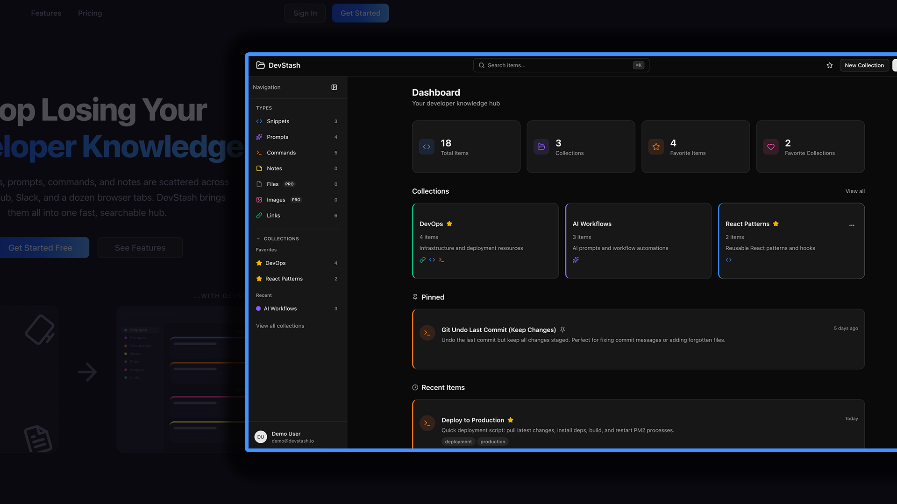

<p align="center">
  
</p>

<h1 align="center">DevStash</h1>

<p align="center">
  A unified hub for developer knowledge & resources
</p>

<p align="center">
  
  
  
  
  
  
</p>

---

Developers keep their essentials scattered across VS Code snippets, browser bookmarks, chat histories, bash history, and random folders. DevStash brings everything into **one fast, searchable, AI-enhanced hub**.

<p align="center">
  
</p>

This project is part of the [Coding With AI](https://www.codingwithaicourse.com) course by Brad Traversy. 

The docs, spec files, and other resources for this project are available in the [course resources repo](https://github.com/bradtraversy/coding-with-ai-course-resources).

## Features

**Core**
- Save code snippets, AI prompts, terminal commands, notes, and links
- Upload files and images (Pro)
- Organize items into collections with many-to-many relationships
- Pin, favorite, and tag items for quick access
- Monaco code editor with syntax highlighting for 30+ languages
- Markdown editor with GitHub Flavored Markdown preview
- Global search / command palette (Cmd+K)
- Dark mode by default, light mode optional

**AI-Powered (Pro)**
- Auto-tag suggestions
- Description generator
- Code explanation
- Prompt optimizer

**Other**
- Email/password and GitHub OAuth authentication
- Email verification and password reset flows
- Rate limiting on auth endpoints
- Stripe subscriptions (Free / Pro tiers)
- File uploads via Cloudflare R2
- Import/export data (JSON free, ZIP with files for Pro)
- Pagination, sorting, and filtering
- Responsive design (desktop, tablet, mobile)

## Tech Stack

| Category       | Technology                     |
| -------------- | ------------------------------ |
| Framework      | Next.js 16 / React 19         |
| Language       | TypeScript 5                   |
| Database       | Neon PostgreSQL                |
| ORM            | Prisma 7                       |
| Auth           | NextAuth v5 (JWT)              |
| Styling        | Tailwind CSS v4 + shadcn/ui   |
| AI             | OpenAI                         |
| Payments       | Stripe                         |
| File Storage   | Cloudflare R2                  |
| Rate Limiting  | Upstash Redis                  |
| Email          | Resend                         |
| Testing        | Vitest                         |

## Getting Started

### Prerequisites

- Node.js 18+
- npm
- A [Neon](https://neon.tech) PostgreSQL database

### Installation

```bash
git clone https://github.com/bradtraversy/devstash.git
cd devstash
npm install
```

### Environment Variables

Copy the example env file and fill in your values:

```bash
cp .env.example .env
```

| Variable | Description |
| -------- | ----------- |
| `NEXT_PUBLIC_APP_URL` | App URL (default: `http://localhost:3000`) |
| `DATABASE_URL` | Neon PostgreSQL connection string |
| `AUTH_SECRET` | NextAuth secret (generate with `npx auth secret`) |
| `AUTH_GITHUB_ID` | GitHub OAuth app ID |
| `AUTH_GITHUB_SECRET` | GitHub OAuth app secret |
| `RESEND_API_KEY` | Resend API key for emails |
| `SKIP_EMAIL_VERIFICATION` | Set to `true` to skip email verification in dev |
| `UPSTASH_REDIS_REST_URL` | Upstash Redis URL for rate limiting |
| `UPSTASH_REDIS_REST_TOKEN` | Upstash Redis token |
| `R2_ACCOUNT_ID` | Cloudflare R2 account ID |
| `R2_ACCESS_KEY_ID` | R2 access key |
| `R2_SECRET_ACCESS_KEY` | R2 secret key |
| `R2_BUCKET_NAME` | R2 bucket name |
| `R2_PUBLIC_URL` | R2 public URL |
| `OPENAI_API_KEY` | OpenAI API key for AI features |
| `STRIPE_SECRET_KEY` | Stripe secret key |
| `STRIPE_PUBLISHABLE_KEY` | Stripe publishable key |
| `STRIPE_WEBHOOK_SECRET` | Stripe webhook signing secret |
| `STRIPE_PRICE_ID_MONTHLY` | Stripe monthly price ID |
| `STRIPE_PRICE_ID_YEARLY` | Stripe yearly price ID |

### Database Setup

```bash
# Run migrations
npx prisma migrate dev

# Seed system item types (snippet, prompt, command, note, file, image, link)
npm run db:seed
```

### Run

```bash
npm run dev
```

Open [http://localhost:3000](http://localhost:3000).

## Scripts

| Command | Description |
| ------- | ----------- |
| `npm run dev` | Start dev server |
| `npm run build` | Build for production |
| `npm run start` | Start production server |
| `npm run lint` | Run ESLint |
| `npm run test` | Run tests (single run) |
| `npm run test:watch` | Run tests (watch mode) |
| `npm run db:migrate` | Create and run migrations |
| `npm run db:seed` | Seed system item types |
| `npm run db:studio` | Open Prisma Studio |

## Project Structure

```
src/
├── app/
│   ├── (auth)/          # Sign-in, register, verify, password reset
│   ├── api/             # API routes (upload, download, stripe, auth)
│   ├── collections/     # Collections list and detail pages
│   ├── dashboard/       # Main dashboard
│   ├── favorites/       # Favorites page
│   ├── items/           # Items list by type (/items/snippets, etc.)
│   ├── profile/         # User profile
│   ├── settings/        # Settings (editor prefs, billing, account)
│   └── page.tsx         # Marketing homepage
├── actions/             # Server actions (items, collections, ai, etc.)
├── components/
│   ├── ui/              # shadcn/ui components
│   ├── items/           # Item cards, drawer, dialogs
│   ├── collections/     # Collection cards, dialogs
│   ├── layout/          # Sidebar, top bar, user menu
│   ├── homepage/        # Marketing page components
│   └── shared/          # Reusable components
├── lib/
│   ├── db/              # Prisma queries (items, collections)
│   ├── prisma.ts        # Prisma client
│   ├── auth.ts          # NextAuth config
│   ├── stripe.ts        # Stripe client
│   ├── openai.ts        # OpenAI client
│   └── r2.ts            # Cloudflare R2 utilities
├── hooks/               # Custom React hooks
└── types/               # TypeScript type definitions
```

## License

This project is licensed under the [MIT License](LICENSE).
